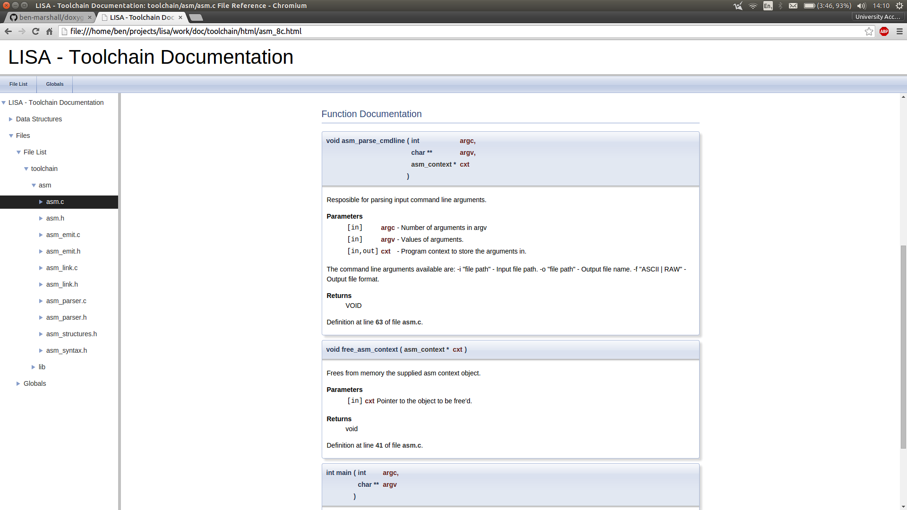
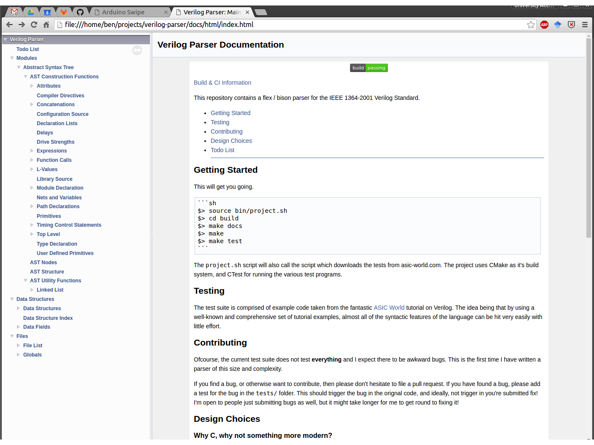
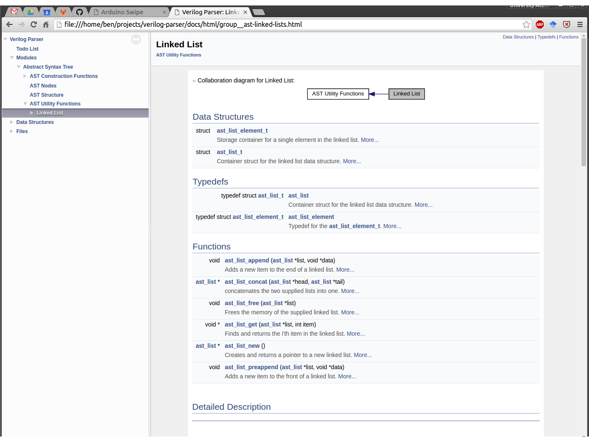

# Doxygen Themes
A collection of the various Doxygen Theme customisations I have created and used in the
past.

---

## Simple

Very basic theme with only the documentation text and navigation visible. No header
colouring or decoration.

---

## Tree

Slightly less hacky, displays the documentation hierarchy using the treeview.
Loosely styled on the excellent readthedocs.

---
